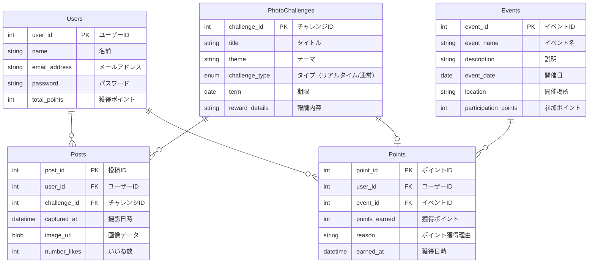

```mermaid
erDiagram
    Users ||--o{ Posts : ""
    Users ||--o{ Points : ""
    Events ||--o{ Points : ""
    PhotoChallenges ||--o{ Posts : ""
    PhotoChallenges ||--o| Points : ""
        
    Users {
        int user_id PK "ユーザーID"
        string name "名前"
        string email_address "メールアドレス"
        string password "パスワード"
        int total_points "獲得ポイント"
    }

    Events {
        int event_id PK "イベントID"
        string event_name "イベント名"
        string description "説明"
        date event_date "開催日"
        string location "開催場所"
        int participation_points "参加ポイント"
    }

    PhotoChallenges {
        int challenge_id PK "チャレンジID"
        string title "タイトル"
        string theme "テーマ"
        enum challenge_type "タイプ（リアルタイム/通常）"
        date term "期限"
        string reward_details "報酬内容"
    }

    Posts {
        int post_id PK "投稿ID"
        int user_id FK "ユーザーID"
        int challenge_id FK "チャレンジID"
        datetime captured_at "撮影日時"
        blob image_url "画像データ"
        int number_likes "いいね数"
    }

    Points {
        int point_id PK "ポイントID"
        int user_id FK "ユーザーID"
        int event_id FK "イベントID"
        int points_earned "獲得ポイント"
        string reason "ポイント獲得理由"
        datetime earned_at "獲得日時"
    }
```
